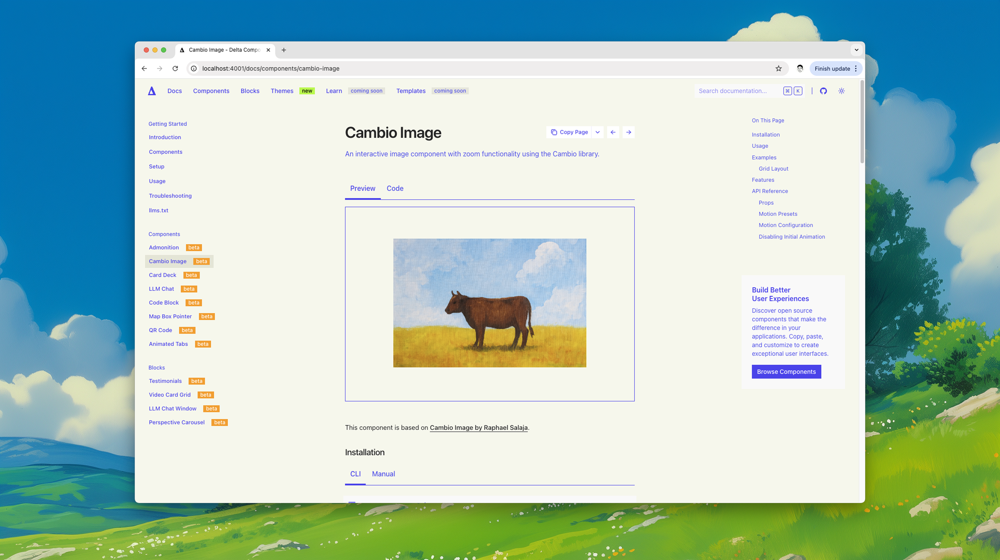

# 𝚫 Delta Components

A collection of modern, accessible, and customizable React components built on top of shadcn/ui with v0 integration.
Delta Components is designed to make the difference in your user experience. Free and open source.

<!-- <video width="640" height="360" controls>
  <source src="./trailer.mp4" type="video/mp4">
  Your browser does not support the video tag.
</video> -->

## Documentation

Visit [deltacomponents.dev](https://deltacomponents.dev) to view the full documentation.

## Tutorial

<!-- <video width="640" height="360" controls>
  <source src="./tutorial.mp4" type="video/mp4">
  Your browser does not support the video tag.
</video> -->

## Contributing

Please read the [contribution guidelines](/CONTRIBUTING.md).

## License

Licensed under the [MIT license](LICENSE).